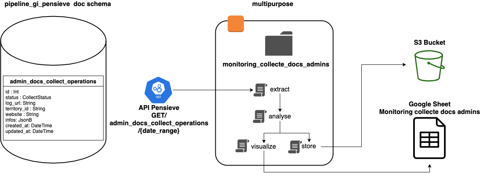

# Scraping Monitoring

The logs are analysed to monitor any scraping anomalies.

## Architecture

## Description

### Input
`extractor.py` and `pensieve_interface.py` extract collection data from Pensieve database via the endpoint 
GET/by_collect_date with range of dates.

### Transformations
`exhaustive_transformer.py` 
This transformation was used for the tests. It basically reproduces Pensieve's database by normalizing the infos field. It also calculates rates for errors.

`first_indicator_transformer.py` 
For each territory, detects collects with issues bases on these criterias :
* `updated_at` interval is higher than 12 days
* `item_scraped_count` changes from a count higher than 10 to nothing 

### Analysis

The variables that would probably be the most useful for detecting problems are:
   * __collect_id__
   * __territory_uid__
   * __website__
   * __updated_at__
   - __request_count__ (number of paths available on the website)
   - __response_count__ (number of paths visited by the spider)
   - __response_status_count/4XX or 5XX__ (number of responses with particular error code)
   - __item_scraped_count__ (number of items scraped)
   - __sqs_pushed_count__ (number of items pushed further in the pipeline)

To prepare the analysis we need to normalize the json containing the scraping statistics and merge it with the columns containing the metadata :

* __Normalize__ : infos (json) to dataframe
* __Relabel__ : relabel columns names
* __Clean__ : filter if multiple collects happening in a single day for a website

Analyse some statistics on each collect and their evolution for one website :

* __errors_count__ : number of total errors / errors 4XX / 5XX
* __errors_rate__ : rate errors / number of responses
* __errors_progression__ : evolution of errors on a website
* more indicators to determine

### Storage

Store on bucket S3 json containing statistics per day of collect.

### Visualisation

Google Sheet with a detailed sheet and a synthetised sheet.

### Output
[Google Sheet Output Test](https://docs.google.com/spreadsheets/d/1KKbu4FAAwwm0aECxCBjqaur6JA7zDD-mJBisTf_bF9k/edit#gid=0)  
[Google Sheet Output](https://docs.google.com/spreadsheets/d/1mEEhldYWgLryzYl1KMiNhblOCepctQuWieNnC8BgNkM/edit#gid=0)  

|Date de l'alerte|  Id de l'alerte| Nom département |      Code      | Nom             |Url dans Pensieve|Collect status     |
|---------------:|:---------------|:----------------|:---------------|-----------------|-----------------|-------------------|
|     18-03-2021 |        S1-0001 |     Normandie   |   FRCOMM76600  |  Le Havre       |    http://      |   finished        |
|     18-03-2021 |        S1-0001 |     Normandie   |   FRCOMM76290  |   Montivilliers |    http://      |closespider_timeout|
|     18-03-2021 |        S1-0001 |     Normandie   |   FRCOMM76000  |    Rouen        |    http://      |   finished        |

## Test the tool
In ws-pensieve (données test en prod)
`export DATABASE_HOST=rdb.pensieve.explain.fr`
In monitoring_collect_docs_admins (local)
`unset PENSIEVE_URL`

